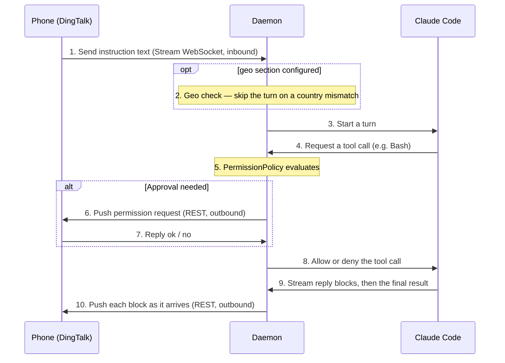

# claude-dingtalk-bridge

[English](README.md) | [简体中文](README.zh.md)

Drive Claude Code on your computer remotely from your phone via DingTalk —
kick off tasks, receive progress, and approve risky operations. It runs on
DingTalk Stream mode, so the computer only makes outbound connections — no
tunneling or public IP needed.

## How it works

Inbound traffic uses a persistent Stream-mode WebSocket; outbound traffic uses
the DingTalk Open Platform REST API. The two paths are independent.



New instructions that arrive while a task is running are queued and processed
in order once the turn finishes; control commands (`/stop`, `ok`, `no`, …)
take effect immediately and are never queued.

## Get started

First-time setup, in order. Steps 1 and 3 are manual; the rest are commands.

```bash
# 1. Create a DingTalk Stream-mode robot — see "DingTalk setup" below.

# 2. Install
git clone <repo> ~/Projects/claude-dingtalk-bridge
cd ~/Projects/claude-dingtalk-bridge
make setup            # create the virtualenv and install dependencies

# 3. Configure
make config           # create ~/.config/claude-dingtalk-bridge/config.yaml
#    then edit that file: client_id, client_secret, authorized_user_id, projects

# 4. Run as a background daemon that starts at login
make daemon-install
make daemon-start
```

Make sure Claude Code is already logged in on this machine (the `claude`
command works) before starting — the daemon reuses its credentials. Once
running, chat 1:1 with the robot in DingTalk; see "Using it from your phone".

## DingTalk setup

One-time, on the DingTalk Open Platform:

1. Own or create a DingTalk organization (DingTalk app → Contacts → create a team).
2. Open https://open-dev.dingtalk.com, sign in with an org admin account, and
   create an app → **Enterprise internal app**.
3. Add the **Robot** capability; set **Message receiving mode** to **Stream
   mode** (no webhook URL needed), then publish / enable the app.
4. On the credentials page, note the **Client ID (AppKey)** and **Client
   Secret (AppSecret)**.
5. Get your own userid (staffId): DingTalk admin console → Contacts → your
   profile → view userid. Or run the daemon first and message the robot — the
   log prints the id of any unauthorized sender.

Put `client_id`, `client_secret` and `authorized_user_id` (the userid above)
into `~/.config/claude-dingtalk-bridge/config.yaml`, along with the project
directories the daemon is allowed to operate on.

## Using it from your phone

Chat 1:1 with the robot in DingTalk. Plain text is an instruction for Claude;
text starting with `/` is a control command (case-insensitive). Permission
replies (`ok`/`no`) are conversational and take no `/`.

Voice messages are transcribed by DingTalk and run as ordinary prompts; images
— alone or alongside text — are downloaded and passed to Claude to read. Both
skip command parsing. When Claude asks a question, the options arrive numbered
on the phone; reply with a number or type your own answer.

| Command | Action |
|---|---|
| `/help` | List all commands |
| `/stop` | Interrupt the current task |
| `/clear` | Interrupt the task and reset the session |
| `/status` | Show runtime status (project, model, tokens, cache) |
| `/pwd` | Show the current project |
| `/ls` | List projects |
| `/cd <name>` | Switch the current project |
| `/session` | Show the current session id |
| `/resume` | List recent sessions |
| `/resume <n>` / `/resume <id>` | Switch to a past session |
| `/model` | List models |
| `/model <n\|name>` | Switch the model |
| `/verbose on\|off` | Verbose mode toggle (stream every step) |
| `/debug on\|off` | Debug mode toggle: skip Claude, debug the daemon only |
| `/compact` | Compact the conversation history (forwarded to Claude) |
| `/context` | Show context window usage (forwarded to Claude) |
| `/usage` | Show usage and cost (forwarded to Claude) |
| `ok` / `yes` / `approve` | Approve a permission request |
| `no` / `deny` / `reject` | Deny a permission request |

## Security

### Inbound access
- Outbound-only Stream WebSocket — the daemon listens on no ports and needs no public IP. **No tunneling involved, so corporate red lines on inbound exposure stay uncrossed.**
- Single-user whitelist — only the account named in `authorized_user_id` can drive Claude. **No other DingTalk account can control the daemon on your machine.**
- Image messages authenticate the sender before any download — an unauthorized user cannot use one image to trigger any network I/O, closing a download-DoS vector.

### Claude tool permissions
- **Any write outside the project directory needs your phone tap.** `Edit` / `Write`-class tools must resolve (after `..` and symlink normalization) under the active project, otherwise the call escalates to the phone. **Even Claude Code's auto mode cannot bypass this layer** — the permission callback lives on the SDK boundary, independent of Claude's own decisions.
- **Bash and friends go through an allowlist with strict prefix matching** (`git` does not silently extend to `gitleaks`); any command containing shell metacharacters (`&&`, `|`, `;`, `>`, `<`, backticks, `$(`, glob characters, …) is detected and escalated regardless — chained commands cannot smuggle past the allowlist.

### Local file permissions
- `config.yaml` is checked at startup; anything looser than `0600` is refused with a `chmod` hint, and `make config` already locks it down on creation — prevents other local users on the same machine from reading your DingTalk `client_secret`.
- The image cache directory is created with `0700` and actively refuses a symlinked parent — guards against pre-creation symlink attacks (an attacker swapping the target path with a symlink before our `mkdir` lands, redirecting our writes to wherever they want).

### Claude Code account safety
Before each turn, the daemon checks the exit IP's country code against the value in your `geo` config; a mismatch terminates the turn — **lowering the risk of Claude Code account flags or bans** from unexpected geographies.

### Phone-side kill switch
Send `/stop` from your phone to interrupt the current turn, or `/clear` to reset the whole session — if a task runs off the rails, the brake is always within reach.

## More commands

All operations are wrapped in the `Makefile`; run `make` with no arguments to
list them.

| Command | Action |
|---|---|
| `make setup` | Create the virtualenv and install dependencies |
| `make config` | Create the config file from the template (if absent) |
| `make start` | Run the daemon in the foreground (logs to terminal) |
| `make test` | Run the unit tests |
| `make daemon-install` | Install as a background daemon that starts at login |
| `make daemon-start` | Start the daemon |
| `make daemon-stop` | Stop the daemon (KeepAlive will not relaunch it) |
| `make daemon-restart` | Restart the daemon |
| `make daemon-status` | Show daemon status |
| `make daemon-uninstall` | Uninstall the daemon |
| `make logs-tail` | Tail the daemon logs in the terminal |
| `make logs-web` | Open the daemon log live-viewer in a browser (`ARGS=...`) |

Daemon logs: `~/Library/Logs/claude-dingtalk-bridge/daemon.{out,err}.log`

Image cache: `~/Library/Caches/claude-dingtalk-bridge/`. Inbound images are
saved here so Claude can read them; files older than 72h are pruned on the
next download (at most once per hour). Nothing else reclaims them, so the
cache lingers when no new images arrive — safe to `rm` by hand.
