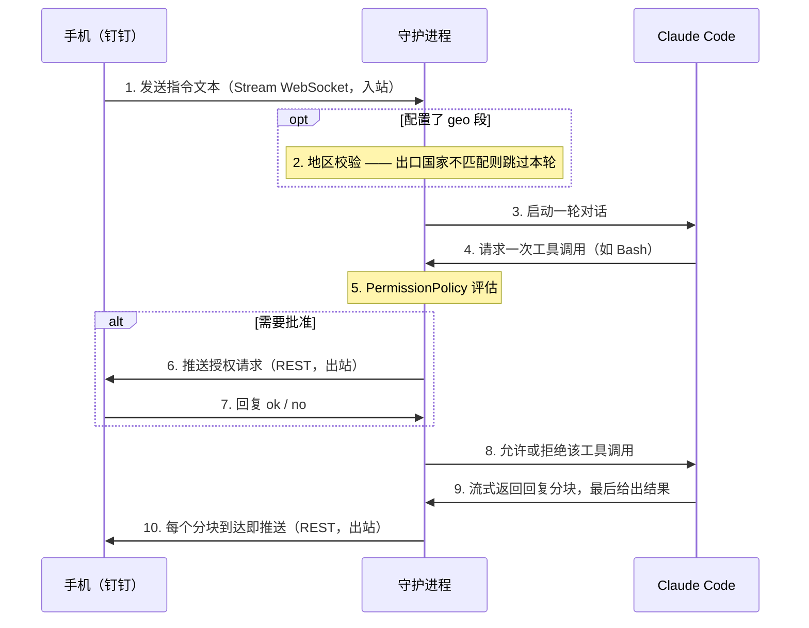

# claude-dingtalk-bridge

[English](README.md) | [简体中文](README.zh.md)

通过钉钉在手机上远程驱动电脑上的 Claude Code —— 发起任务、接收进度、批准有风险的操作。它运行在钉钉 Stream 模式下，电脑只发起出站连接，无需内网穿透或公网 IP。

## 工作原理

入站流量走一条持久的 Stream 模式 WebSocket，出站流量走钉钉开放平台的 REST API。两条通路彼此独立。



任务运行期间到达的新指令会被排队，待本轮结束后按顺序处理；控制命令（`/stop`、`ok`、`no` 等）立即生效，从不排队。

## 快速开始

首次配置，按顺序进行。第 1、3 步为手动操作，其余为命令。

```bash
# 1. 创建一个钉钉 Stream 模式机器人 —— 见下文“钉钉配置”。

# 2. 安装
git clone <repo> ~/Projects/claude-dingtalk-bridge
cd ~/Projects/claude-dingtalk-bridge
make setup            # 创建虚拟环境并安装依赖

# 3. 配置
make config           # 创建 ~/.config/claude-dingtalk-bridge/config.yaml
#    然后编辑该文件：client_id、client_secret、authorized_user_id、projects

# 4. 作为开机自启的后台守护进程运行
make daemon-install
make daemon-start
```

启动前请确认本机已登录 Claude Code（`claude` 命令可用）—— 守护进程会复用它的凭证。运行后，在钉钉里与机器人单聊即可；见“在手机上使用”。

## 钉钉配置

在钉钉开放平台上一次性完成：

1. 拥有或创建一个钉钉组织（钉钉 App → 通讯录 → 创建团队）。
2. 打开 https://open-dev.dingtalk.com ，用组织管理员账号登录，创建应用 → **企业内部应用**。
3. 添加**机器人**能力；将**消息接收模式**设为 **Stream 模式**（无需 webhook 地址），然后发布 / 启用应用。
4. 在凭证页面记下 **Client ID（AppKey）**和 **Client Secret（AppSecret）**。
5. 获取你自己的 userid（staffId）：钉钉管理后台 → 通讯录 → 你的资料 → 查看 userid。或者先启动守护进程并给机器人发消息 —— 日志会打印任何未授权发送者的 id。

把 `client_id`、`client_secret` 和 `authorized_user_id`（上面那个 userid）填入 `~/.config/claude-dingtalk-bridge/config.yaml`，并列出允许守护进程操作的项目目录。

## 在手机上使用

在钉钉里与机器人单聊。纯文本是发给 Claude 的指令；以 `/` 开头的文本是控制命令（不区分大小写）。授权回复（`ok`/`no`）是口语化的，不带 `/`。

语音消息由钉钉转写后作为普通提示词运行；图片 —— 单独发送或与文本一同发送 —— 会被下载并传给 Claude 阅读。两者都跳过命令解析。当 Claude 提问时，选项会带编号发到手机上；回复编号或自行输入答案均可。

下表中**命令本身只有英文**，钉钉上请照此输入。

| 命令 | 作用 |
|---|---|
| `/help` | 列出所有命令 |
| `/stop` | 中断当前任务 |
| `/clear` | 中断任务并重置会话 |
| `/status` | 显示运行状态（项目、模型、token、缓存） |
| `/pwd` | 显示当前项目 |
| `/ls` | 列出项目 |
| `/cd <name>` | 切换当前项目 |
| `/session` | 显示当前会话 id |
| `/resume` | 列出近期会话 |
| `/resume <n>` / `/resume <id>` | 切换到某个历史会话 |
| `/model` | 列出模型 |
| `/model <n\|name>` | 切换模型 |
| `/verbose on\|off` | 详细模式开关（流式输出每一步） |
| `/debug on\|off` | 调试模式开关：跳过 Claude，仅调试守护进程 |
| `/compact` | 压缩对话历史（转发给 Claude） |
| `/context` | 显示上下文窗口用量（转发给 Claude） |
| `/usage` | 显示用量与花费（转发给 Claude） |
| `ok` / `yes` / `approve` | 批准一次授权请求 |
| `no` / `deny` / `reject` | 拒绝一次授权请求 |

## 更多命令

所有操作都封装在 `Makefile` 里；不带参数运行 `make` 即可列出全部。

| 命令 | 作用 |
|---|---|
| `make setup` | 创建虚拟环境并安装依赖 |
| `make config` | 从模板创建配置文件（若不存在） |
| `make start` | 在前台运行守护进程（日志输出到终端） |
| `make test` | 运行单元测试 |
| `make daemon-install` | 安装为开机自启的后台守护进程 |
| `make daemon-start` | 启动守护进程 |
| `make daemon-stop` | 停止守护进程（KeepAlive 不会重新拉起） |
| `make daemon-restart` | 重启守护进程 |
| `make daemon-status` | 显示守护进程状态 |
| `make daemon-uninstall` | 卸载守护进程 |
| `make logs-tail` | 在终端中跟踪守护进程日志 |
| `make logs-web` | 在浏览器中打开守护进程日志实时查看器（`ARGS=...`） |

守护进程日志：`~/Library/Logs/claude-dingtalk-bridge/daemon.{out,err}.log`

图片缓存：`~/Library/Caches/claude-dingtalk-bridge/`。入站图片下载到此处供 Claude 阅读；下次下载时会清理超过 72 小时的旧文件（最多每小时一次）。除此之外没有其他清理机制，所以长时间没有新图片时缓存会一直留着，可以手动 `rm`。
